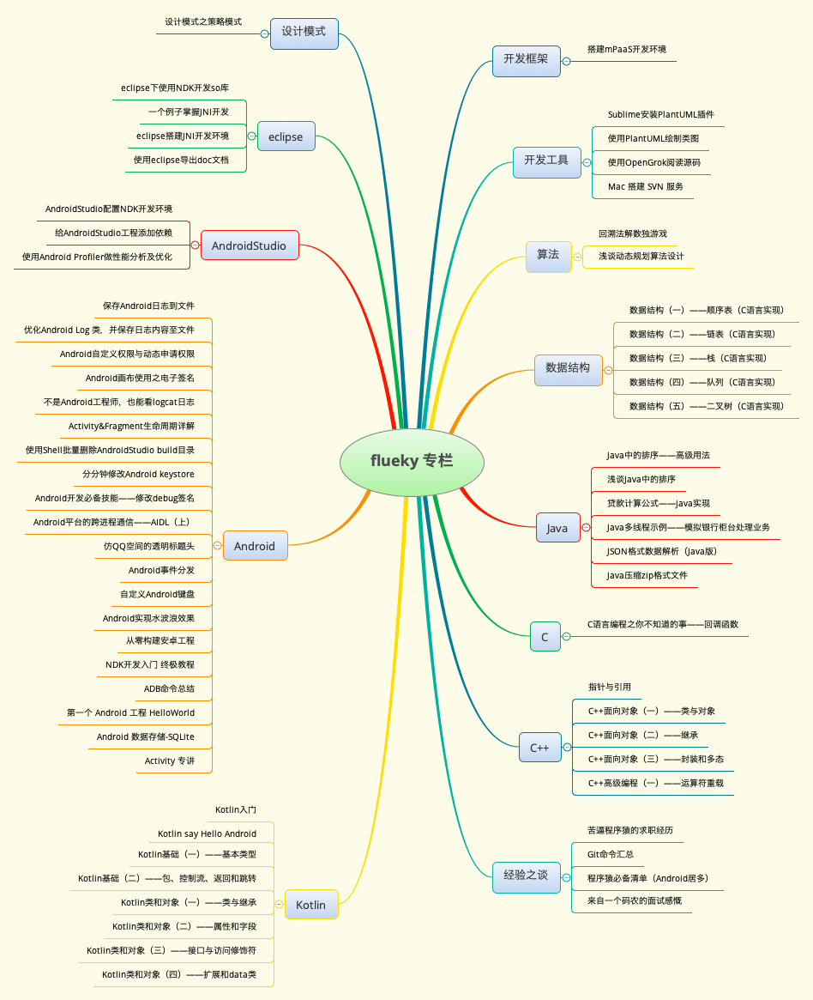

如果你喜欢作者的文章，读后觉得收获很大......

如果你在开发或学习的过程中作者的文章帮到了你......

你可以对作者进行**小额赞助**一下，让我有动力继续写出更高质量的文章。

# 赞赏方式

## 支付宝

 

一分钱也是爱，记得领红包哟！！！

## 微信

# 技术脑图

附上作者技术脑图，如想阅读相关技术领域文章，可联系作者编写。在技术能力范围之内，定不负所望。

图中即为作者之前编写或翻译的所有文章。

已涉猎的技术领域包括：C/C++ Java 算法 数据结构 设计模式 Android开发。

# 联系方式

1. e-mail: flueky@sina.com
2. 公众号

